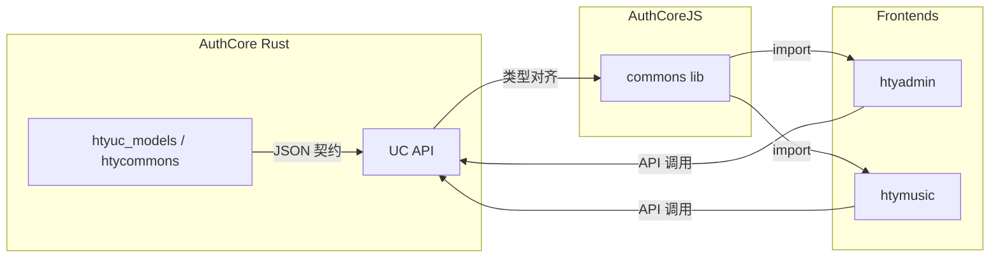

# @authcore/commons

Shared TypeScript types aligned with [AuthCore](https://github.com/alchemy-studio/authcore) (Rust) UC API. Used by **htyadmin** and **htymusic** frontends.

## Alignment

- **Response / errors**: `HtyResponse<T>`, `HtyErr`, `HtyErrCode` ↔ `htycommons/src/common.rs`
- **User / identity**: `HtyUser`, `HtyUserApp`, `WeixinUserInfo`, `TeacherInfo`, `StudentInfo`, `HtyUserSetting`, `HtyUserInfoRole`, `HtyApplyUser` ↔ AuthCore `HtyUser`, `UserAppInfo`, `MetaUserAppInfo`, etc.
- **Roles / RBAC**: `HtyRole`, `HtyAction`, `HtyLabel`, `HtyStates`, `HtyBaseRoles`, `HtySuperRoles`, `HtyRoles` ↔ `htyuc_models` role/action/label
- **App / tags / tongzhi / group / resource / template / task**: See AuthCore `htyuc_models` and `htycommons` for JSON contract.

## Usage

```ts
import {
  HtyResponse,
  HtyUser,
  HtyUserApp,
  HtyRole,
  HtyStates,
  Tongzhi,
  TongzhiStatuses,
} from '@authcore/commons';
```

## Local development

From this repo:

```bash
npm install
npm run build
npm link
```

In htyadmin or htymusic:

```bash
npm link @authcore/commons
```

## Versioning

When AuthCore UC API or types change, update this package and bump version; upgrade the dependency in htyadmin and htymusic.

架构关系示意


